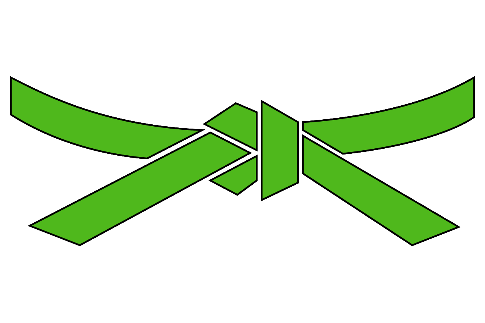












    
    
    
    
    
    
    
    
    
    
    
    
    






<!--Inactive Members-->

<!--Board Areas-->


    <h1 class="display-4">Dojo Achievements</h1>
    
Active summary of the community's competence claims

    

    

        

            <h1 class="display-4">{{site.data.members | size}}</h1>
            
            <h3>Members with Belts</h3>
            Active Members: {{active_members | size}}
        

        

            <h1 class="display-4">{{belt_total}}</h1>
            
            <h3>Total Belts Granted</h3>
            All-time Belt Count
        

    

    

    <h1 class="text-center my-5">Appeal & Awareness</h1>
    

        

            <h1 class="display-5">{{white_total}}</h1>
            
            <h3>White Belts</h3>
        

        

            <h1 class="display-5">{{green_total}}</h1>
            
            <h3>Green Belts</h3>
        

    

    

    <h1 class="text-center my-5">Action & Acceleration</h1>
    

        

            <h1 class="display-5">{{red_total}}</h1>
            
            <h3>Red Belts</h3>
        

        

            <h1 class="display-5">{{black_total}}</h1>
            
            <h3>Black Belts</h3>
        

    

    
        
    

<h3 id="board-area-rep">Board Area Representation of Active Members</h3>
<ul class="list-group">
    
    
    <li class="list-group-item d-flex justify-content-between align-items-center active">
        {{boardArea}}
        {{active_members | where_exp: "member", "member.board-area == boardArea" | size }}
    </li>
    
    <li class="list-group-item d-flex justify-content-between align-items-center">
        {{orgUnit}}
        {{active_members | where_exp: "member", "member.org-unit == orgUnit" | size }}
    </li>
    
    
</ul>

<em>* Stats are based on those who have sumbitted for belts. Rank totals show how many actively hold that belt. Higher belts are not included in lower belt totals, but are reflected in the Total Belts Granted.</em>

<em>** Inactive Members: {{inactiveArr | size}}</em>

